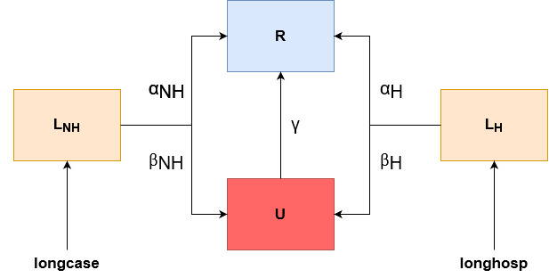

# Stochastic mathematical model for the estimation of long COVID in Washington state

Here we present our framework for the estimation of long COVID in Washington state through the use of a stochastic mathematical model coded in [odin](https://mrc-ide.github.io/odin/index.html) and executed through the programming language [R](https://www.r-project.org/). Though this example has been created using data for Washington state, and the data we have available, the code is flexible and can adapt to the information you have available if correctly specified.

There are three main sections to using the model in this walkthrough, all found within the R folder.
1) Fitting the model to data
2) Running the model
3) Plotting results

# Fitting the model

This is carried out using the file "R/1_fit_model_to_data.R". The user loads in the data and specifies the names of the parameters to fit, the starting, lower and upper values. The function `fitting_results()` takes in this data, and other background information, to utilise the function `optim()` from the **stats** package to fit the model the [least squares method](https://en.wikipedia.org/wiki/Least_squares). Model predictions are compared to the [Househould Pulse Long COVID estimates](https://www.cdc.gov/nchs/covid19/pulse/long-covid.htm) to gauge the accuracy of the model. 

The results of this process are then saved and used in the next section.

# Running the model

# Model description

Figure 1. Model diagram showing the progression between states. Non-hospitalized cases (longcase) and Hospitalized cases (longhosp) enter the acute long COVID compartments LNH¬ and LH respectively. These progress to either recovered, R, or unrecovered, U with the probability αNH and αH or βNH or βH respectively.

Here we use a stochastic compartmental model to estimate the burden of long COVID. Each compartment contains 8 age categories, 5 race/ethnicity groups, 3 vaccination categories and 2 sexes, as well as an unknown category for missing information for each group. This results in 162 sub compartments per compartment. The number of sub-compartments within each compartment is due to the available data on cases and hospitalizations, and probabilities of long COVID. 

The size of these compartments is flexible and change automatically dependent on the dimensions and names of the case and hospitlization data provided to the model (the files starting with hosp_ and nonhosp_ found in data/processed/case_hospitalization_data/).
