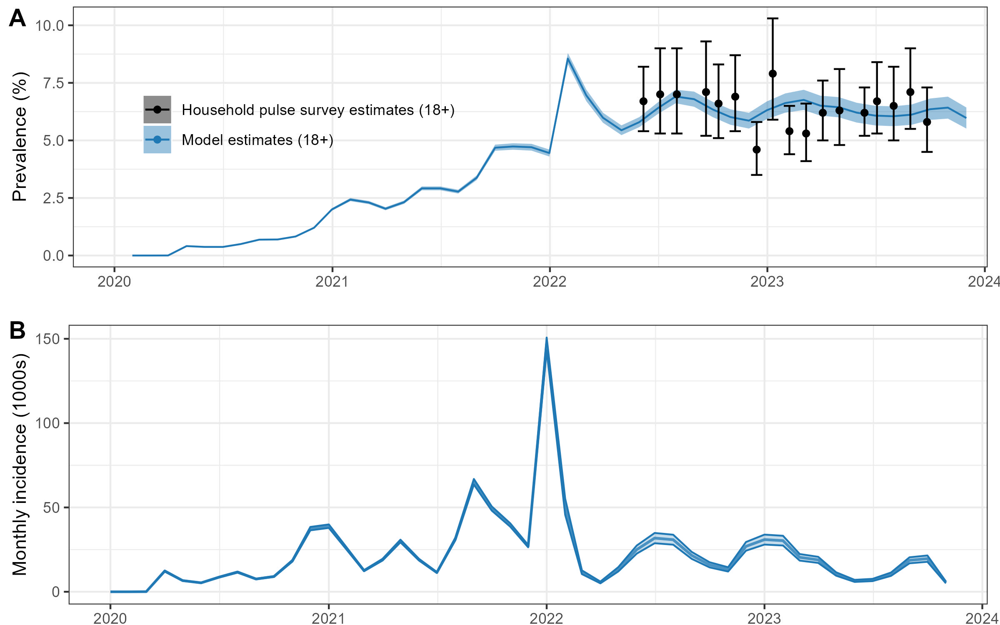
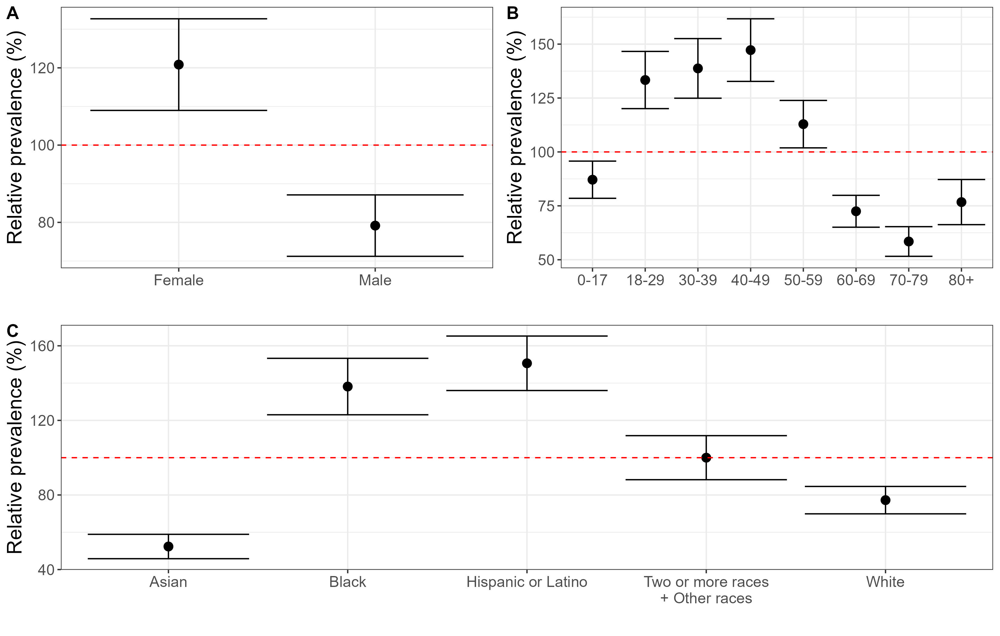
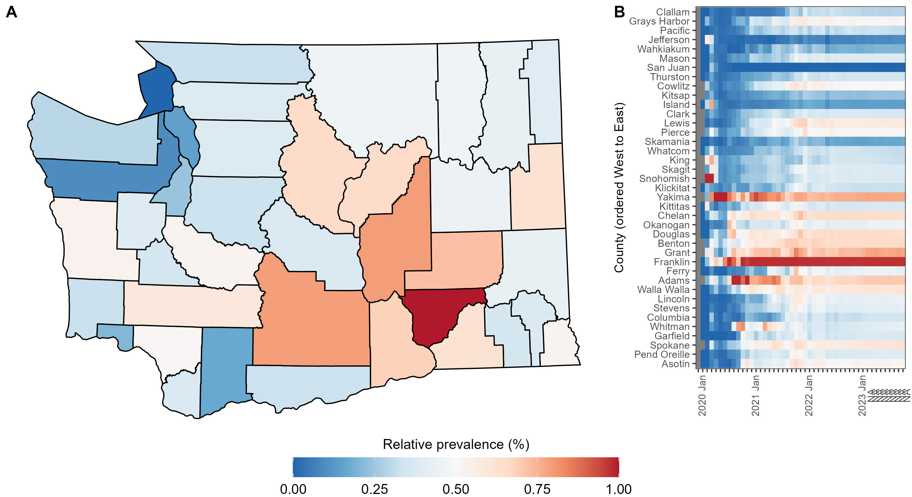

# Stochastic mathematical model for the estimation of long COVID in Washington state

Here we present our framework for the estimation of long COVID in Washington state through the use of a stochastic mathematical model coded in [odin](https://mrc-ide.github.io/odin/index.html) and executed through the programming language [R](https://www.r-project.org/). By using a wide range of estimates from literature, and employing the [Latin Hypercube Sampling](https://en.wikipedia.org/wiki/Latin_hypercube_sampling) method for parameter sampling we are able to produce robust estimates of the burden of long COVID, broken down by age group, sex, race-ethnicity and county.

Though this example has been created using data for Washington state, and the data we have available, the code is flexible and can adapt to the information you have available if correctly specified.

There are three main sections to using the model in this walkthrough, all found within the R folder.
1) Fitting the model to data
2) Running the model
3) Plotting the results

# Fitting the model

This is carried out using the file [1_fit_model_to_data.R](R/1_fit_model_to_data.R). The user loads in the data and specifies the names of the parameters to fit, the starting, lower and upper values. The function `fitting_results()` takes in this data, and other background information, to utilise the function `optim()` from the **stats** package to fit the model the [least squares method](https://en.wikipedia.org/wiki/Least_squares). Model predictions are compared to the [Househould Pulse Long COVID estimates](https://www.cdc.gov/nchs/covid19/pulse/long-covid.htm) to gauge the accuracy of the model. 

The results of this process are then saved and used in the next section.

# Running the model

Using [2_run_model.R](R/2_run_model.R) the user specifies the parameters they would like to vary using [Latin Hypercube Sampling](https://en.wikipedia.org/wiki/Latin_hypercube_sampling) to explore variation in the parameter. This allows us to explore a wide range of different values for each parameter specified, and captures some of the uncertainty that exists in this rapidly changing field of study.

After specifying the baseline parameters, the user runs the model using the function `run_odin_model()`. This will iterate through each of the LHC samples and produce estimates of the long COVID burden each time (and a plot showing a visual comparison).

Once all the runs have been completed, the results will be aggrgated and 95% CI's of the estimates produced. These results are then exported to be used in plotting the results.

# Plotting the results

The final script, [3_plot_results.R](R/3_plot_results.R), uses several functions are used to process the model results and relevant demographic data to produce estimates of the prevalence of long COVID.

<em>Input data and prevalence estimates of long COVID. (A) Estimated symptomatic infections, reported cases, hospitalizations, and estimated long COVID incidence over time. (B) Model predictions and [Househould Pulse Long COVID estimates](https://www.cdc.gov/nchs/covid19/pulse/long-covid.htm) point estimates of the prevalence of long COVID over time.</em>

For the subgroup analysis we can only present **relative** estimates of prevalence. In order to account for temporally varying issues with surveillance we use infection estimates from a previously designed and implemented [mathematical model of COVID transmission](https://iazpvnewgrp01.blob.core.windows.net/source/2021-02/reports/pdf/Sustained_reductions_in_transmission_have_led_to_declining_COVID_19_prevalence_in_King_County_WA.pdf) used by the Washington State Department of Health. These estimates suggest that ~80% of symptomatic cases of COVID are not recorded, with this percent varying substantially over time.

These "missing" symptomatic cases are included in our model, but do not contain any subcompartment information (age, sex, race-ethnicity, vaccination status or county). This means that while our overall estimates of the burden of long COVID closely match those surveyed in the [Househould Pulse Long COVID estimates](https://www.cdc.gov/nchs/covid19/pulse/long-covid.htm), our case breakdowns do not as ~80% of our information is without this data. Due to this we can only report the **relative** prevalence. This allows us to highlight disparities between groups, but not to comment on the actual prevalence encountered.

<em>The relative prevalence of long COVID by different (A) sexes, (B) age groups and (C) race/ethnicities at the final timepoint in the data.</em>

<em>The relative prevalence of long COVID by county in Washington State at the final timepoint in the data.</em>

# Model description

<em>Model diagram showing the progression between states. Non-hospitalized cases (longcase) and Hospitalized cases (longhosp) enter the acute long COVID compartments LNH and LH respectively. These progress to either recovered, R, or unrecovered, U with the probability αNH and αH or βNH or βH respectively.</em>

Here we use a stochastic compartmental model to estimate the burden of long COVID. Each compartment contains 8 age categories, 5 race/ethnicity groups, 3 vaccination categories and 2 sexes, as well as an unknown category for missing information for each group. This results in 162 sub compartments per compartment. The number of sub-compartments within each compartment is due to the available data on cases and hospitalizations, and probabilities of long COVID. 

The size of these compartments is flexible and change automatically dependent on the dimensions and names of the [case](data/processed/case_hospitalization_data/nonhosp_case_age_sex_race_time_all_counties_20230222.rds) and [hospitalization](data/processed/hosp_case_age_sex_race_time_all_counties_20230222.rds) data provided to the model.
 
